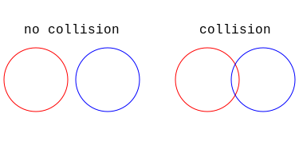
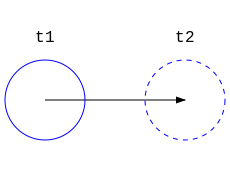
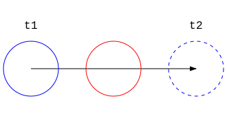
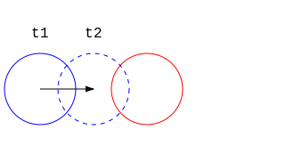
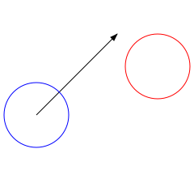
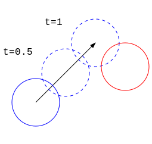
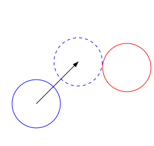

# Collision Detection

This n-body simulation simulates a system of circular bodies interacting through gravity on a 2d plane. If we wish to mimic the real world we will want to be able to simulate collisions within this system. 

I invite you to look at the ['Elastic collision' Wikipedia page](https://en.wikipedia.org/wiki/Elastic_collision) where you will see many mathematical equations describing how two bodies react after a collision. We can easily implement these formulas, et voila, we are done.. right? Well not really. Physics can tell us how bodies react upon collision, but to simulate this we will be faced with some other more computer sciency problems, the main one being *collision detection*.

Right, we need to know *when* we should apply our physical formulas. Well we know our bodies are circles, so how about checking when they overlap, that should tell us if they are colliding.

<div align="center"></div>

This is simple enough using the Pythagorean theorem. We can simply check if the distance between the two centers of the circles is smaller than the combined radii, if so we know we have a collision.

```math
(x_1-x_2)^2+(y_1-y_2)^2 \leq (r_1+r_2)^2
```

This method however, only checks for collisions after they happen (*a posteriori*). In the context of the simulation this is a bad thing.  The simulation updates with discrete time steps; at every time step a particles position is updated by adding it's velocity multiplied by the size of the time step $\Delta$ to it. For example, if at time $t_1$ a particle with position $(x,y)$ has a velocity of $5$ along the $x$ axis and $0$ along the $y$ axis, then with $\Delta = 1$ at $t_2$ we will have updated it's position to $(x+5,y+0)$.

<div align="center"></div>

Maybe you can start seeing the problem. A particle could be moving fast enough such that between two time steps, it entirely jumps over another particle.

<div align="center"></div>

In this scenario an a posteriori method of collision detection will fail to notice a collision did in fact happen. Of course we could just make the time steps smaller, for example with $\Delta = 0.25$ we would get the following:

<div align="center"></div>

And here the circles do overlap so they would get detected by our a posteriori collision detection algorithm. But making smaller time steps is computationally expensive, as we'd have to go through all computations inversely as many times. So with $\Delta = 0.25$ we'd have to do many operations $4$ times instead of $1$. Yikes.

Despite these limitations many large n-body simulations use a posteriori collision detection because they don't require strong accuracy for collisions and can hence afford rather large time steps. In such a scenario the method tends to be computationally efficient. 

The alternative is *a priori collision* detection, such collision detection uses typically complex algorithms to predict the exact point at which two bodies will collide. This means better accuracy and stability, but it comes at the cost of more complexity which can in term also mean less computational efficiency. 

What is likely the most popular and best a priori collision detection method is described [here](https://programmerart.weebly.com/separating-axis-theorem.html). However, I attempted to find such a method without consulting the interned and stumbled upon a simpler solution which only works for circles (ok for this simulation).

Suppose we have two circles with centers at $(x_1,y_1)$ and $(x_2, y_2)$ and radii $r_1$ and $r_2$, one is stationary whilst the other has a velocity vector $v_1$

<div align="center"></div>

First, we notice that if we multiply $v_1$ by some factor $0 < t < |v_1|$ and add it to the position the circle, we'd move it along the path of the velocity vector.

<div align="center"></div>

We also remember that the two circles will collide if $(x_1-x_2)^2+(y_1-y_2)^2 \leq (r_1+r_2)^2$. Now let's add the matching velocity vector multiplied by some factor $t$ to each coordinate in this equation ($x_1$, $x_2$, $y_1$, $y_2$): 

```math
(\colorbox{skyblue}{$t v_{x1}$}+x_1-\colorbox{skyblue}{$t v_{x2}$}+x_2)^2+(\colorbox{skyblue}{$t v_{y1}$}+y_1-\colorbox{skyblue}{$t v_{y2}$}+y_2)^2 \leq(r_1+r_2)^2
```

Now with $0 < t < |v_1|$ we have an equation which looks at whether two circles collide at any point on their velocity vectors.

All that's left to do is to solve for $t$ to find out at which point along each circle's velocity vector the circles collide. However, we are only interested in the first moment a collision happens. So we check when the left hand side of the equation equals the right hand side.

```math
(t v_{x1}+x_1-t v_{x2}+x_2)^2+(t v_{y1}+y_1-t v_{y2}+y_2)^2 \colorbox{skyblue}{=}(r_1+r_2)^2
```


And the smallest solution of this equation with $0 < t < |v_1|$ will be what we are looking for.

<div align="center"></div>

Great! Of course you might be wondering how to isolate $t$, but this is not all that interesting and a little bit big for this document, so uhh... exercise for the reader I guess! You can find the end result in the code :wink:. 

You may have noticed that our equation is just a quadratic formula, which means we can use the discriminant to establish whether or not two bodies collide.
